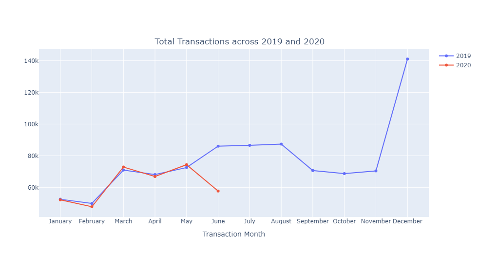

# Analysis of Credit Card Transactions
 

## Overview

This repository contains the code and analysis for an Exploratory Data Analysis (EDA) of credit card transactions. The dataset consists of approximately 1.3 million credit card transactions made by 983 distinct individuals. The transactions date from January 1, 2019, to June 21, 2020.

## Objective

 
The main objective of this analysis is to gain insights into the credit card transactions data through a question-answer based approach. By exploring the data, we aim to understand patterns, trends, and potential factors that influence legitimate and fraudulent transactions.

## Insights Gained

<strong>Note: Detailed insights along with plots can be found in the <a href="https://github.com/Oyebamiji-Micheal/Analysis-of-Credit-Card-Transactions/blob/main/observations.docx">word document file.</a></strong>

The following are some of the key insights obtained from the analysis:

### Transaction Overview
- Total transactions completed in 2019: 924,850
- Total transactions completed in 2020: 371,825
- Highest amount in a single transaction: 28,948.9

### Transaction Distribution
- Monthly transactions from January to June 2019 and 2020 were relatively consistent, with roughly 52,000 transactions completed in January of both years.
- The highest number of transactions occurred in December 2019, totaling 141,060.
- A straight-line pattern is observed in total transactions completed in June, July, and August 2019.

### Legitimate and Fraudulent Transactions
- Fraudulent transactions follow a gradual decrease from January to November 2019 and a sharp increase in December 2019.
- Each month throughout 2019, the number of fraudulent transactions exceeded that of 2020, except for May, where 527 fraudulent transactions occurred in 2020 compared to 408 in 2019.
- No significant correlation is observed between individuals' age and the likelihood of being defrauded.

### Gender Analysis
- Despite females having a significantly higher number of completed transactions, the number of fraud victims is higher among males than females.

### City Analysis

- Cities with the most legitimate transactions completed:
>- Birmingham: 5,606 transactions
>- San Antonio: 5,105 transactions
>- Utica: 5,080 transactions

- Cities with the most fraudulent transactions completed:
>- Houston: 39 transactions
>- Utica: 33 transactions
>- Huntsville: 29 transactions

### Dependencies
- numpy
- pandas
- matplotlib
- cufflinks
- seaborn
- plotly